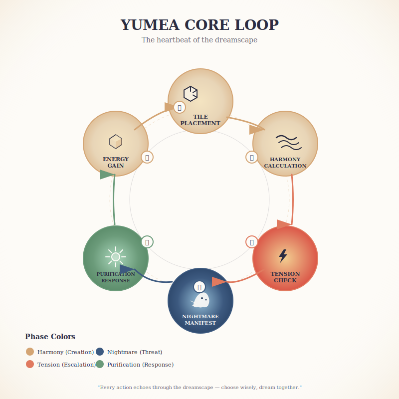

# Diagram Generation Plan — Yumea Visual Explanations

> *Beautiful, rigorous diagrams that explain systems, evolution, and interactions.*

---

## Diagram Categories

### 1. System Architecture Diagrams

#### Core Loop Visualization
**What:** The complete player turn flow
**Elements:**
- Tile placement action
- Harmony calculation (cascading connections)
- Tension escalation
- Nightmare manifestation
- Purification response
**Style:** Circular flow with emotional color coding (harmony = warm golds, tension = sharp oranges, nightmares = desaturated blues)

#### Emotional Axis Map
**What:** The four mirrored emotional pairs
**Elements:**
- Fear ↔ Courage
- Despair ↔ Hope  
- Isolation ↔ Connection
- Chaos ↔ Balance
**Style:** Horizontal mirrored bars, with Nightmares on left (corrupted), Anchors on right (restored)

#### Nightmare Tier Pyramid
**What:** Escalation from Whispers to Reverberations
**Elements:**
- Tier 1: Whispers (10 cards, subtle)
- Tier 2: Echoes (12 cards, manifest)
- Tier 3: Reverberations (8+ cards, boss)
**Style:** Actual pyramid shape, with visual intensity increasing upward

### 2. Evolution Diagrams

#### Game Version Timeline
**What:** v0.1 → v0.2 → v0.3 → v0.4
**Elements:**
- 2023: Dreams of Peace (family promise origin)
- 2024: Dreamscapers framework (12 personas locked)
- 2025: Yumea rebrand (systems consolidated)
- Target: Playtest-ready (PnP kit)
**Style:** Horizontal timeline with system icons, emotional arc overlay

#### Energy Economy Evolution
**What:** Three iterations of the core resource
**Elements:**
- v0.2: 1 💠/turn (too tight)
- v0.2b: 1.3 💠/player/turn (scaling)
- v0.3: Cap 3→5 (big play storage)
**Style:** Side-by-side comparison with gameplay impact notes

#### Persona Balance Journey
**What:** From uneven ultimates to PVU grid
**Elements:**
- Trickster >>> Envoy (problem)
- PVU scoring formalization (solution)
- Current balance status
**Style:** Before/after grid comparison

### 3. Interaction Maps

#### System Interconnection Web
**What:** How all systems feed each other
**Elements:**
- Tile placement → Harmony → Anchor completion → Dream energy
- Tension deck → Nightmare spawn → Corruption → Purification need
- Persona abilities → Action efficiency → Resource acceleration
**Style:** Network graph with thickness showing connection strength

#### Feedback Loops
**What:** Positive and negative cycles
**Elements:**
- Positive: Harmony → More tiles → More harmony (snowball)
- Negative: Tension → Nightmares → Corruption → Harder purification (death spiral)
- Stabilizing: Purification → Tension reduction → Breathing room
**Style:** Loop diagrams with reinforcing (+) and balancing (-) markers

### 4. Component Architecture

#### Card Ecosystem
**What:** How card types interact
**Elements:**
- Persona cards (12, persistent)
- Nightmare cards (30+, escalating)
- Blueprint cards (~40, pattern-building)
- Purification cards (80, restorative)
- Goal cards (12→20+, objectives)
**Style:** Card silhouettes with quantity and relationship arrows

#### Board State Visualization
**What:** What the table looks like mid-game
**Elements:**
- Central dreamscape (hex grid)
- Player boards (persona, energy, held tiles)
- Tension track (escalation marker)
- Nightmare display (active threats)
- Anchor cards (in-progress, completed)
**Style:** Isometric or top-down view of full game state

### 5. Comparative Analysis

#### Replayability Score Breakdown
**What:** 7.1/10 → 8.8-9.3 potential
**Elements:**
- Current: First play ✅, Map variability ✅, Asymmetry ✅
- Gap: Communal goals ⚠️, Engine building ⚠️, Combo systems ⚠️
- Target: With improvements projected
**Style:** Horizontal bar chart with gap indicators

#### Competitive Landscape
**What:** Where Yumea sits in the market
**Elements:**
- Spirit Island (complexity target)
- Dixit (emotional resonance)
- Cascadia (tile placement elegance)
- Yumea's unique position: "Spirit Island meets Dixit's heart"
**Style:** 2D positioning map (complexity × emotional depth)

---

## Visual Style Guide

### Color Palette

**Harmony (Warm):**
- Primary: #D4A574 (warm gold)
- Secondary: #E8D5B7 (soft cream)
- Accent: #F4E4C1 (light amber)

**Tension (Sharp):**
- Primary: #E07A5F (terracotta)
- Secondary: #F2CC8F (caution yellow)
- Accent: #D62828 (alert red)

**Nightmares (Corrupted):**
- Primary: #3D5A80 (desaturated blue)
- Secondary: #98C1D9 (sickly cyan)
- Accent: #1D3557 (deep void)

**Neutral (Grounding):**
- Background: #FDFBF7 (warm white)
- Text: #2B2D42 (soft black)
- Accent: #6D6875 (muted purple-grey)

### Typography

**Headers:** Serif with warmth (Crimson Text, Merriweather)
**Body:** Clean sans-serif for diagrams (Inter, Source Sans Pro)
**Labels:** Condensed for space efficiency (Roboto Condensed)

### Visual Language

- **Soft edges:** Rounded corners, organic shapes (dreamlike)
- **Layered depth:** Subtle shadows, overlapping elements (psychological space)
- **Symbolic icons:** Minimal, recognizable, emotionally resonant
- **Generous whitespace:** Breathing room, clarity, elegance

---

## Generation Tools

### Primary: Mermaid.js + Custom Styling
- Flowcharts for core loops
- Sequence diagrams for turn structure
- Pie charts for component breakdown

### Secondary: Excalidraw / Figma
- Hand-drawn aesthetic for concepts
- Precise layouts for board states
- Character/design sheets

### Tertiary: DALL-E / Midjourney (with control)
- Mood boards for art direction
- Abstract representations of systems
- Background textures for diagrams

---

## Integration with Wiki

### Diagram Placement

| Wiki Page | Diagrams Included |
|-----------|-------------------|
| index.md | System interconnection web, replayability score |
| core-loop.md | Core loop visualization, feedback loops |
| personas.md | Persona matrix, balance journey |
| nightmares.md | Nightmare tier pyramid |
| blueprints.md | Anchor completion tree |
| cards.md | Card ecosystem diagram |
| chronology/timeline.md | Version timeline, evolution diagrams |
| interconnections.md | Full system web, feedback analysis |
| evaluation/gaps.md | Replayability breakdown |

### Embedding Format

```markdown

*The emotional arc of a turn: choice → consequence → collaboration*
```

---

## Production Timeline

### Phase 1: Structural Diagrams (Week 1)
- [ ] Core loop visualization
- [ ] System interconnection web
- [ ] Emotional axis map

### Phase 2: Evolution Diagrams (Week 2)
- [ ] Version timeline
- [ ] Energy economy evolution
- [ ] Persona balance journey

### Phase 3: Comparative & Component (Week 3)
- [ ] Replayability score breakdown
- [ ] Card ecosystem
- [ ] Board state visualization

### Phase 4: Polish (Week 4)
- [ ] Style consistency pass
- [ ] Color accessibility check
- [ ] Mobile-responsive SVGs

---

## Success Criteria

- **Accurate:** Diagrams reflect actual game systems, not idealized versions
- **Beautiful:** Professional enough for publication
- **Clear:** Complex systems made understandable
- **Consistent:** Unified visual language throughout
- **Accessible:** Colorblind-friendly, readable at various sizes

---

*Plan created: 2026-02-06*
*Next step: Generate Phase 1 diagrams, integrate into wiki*