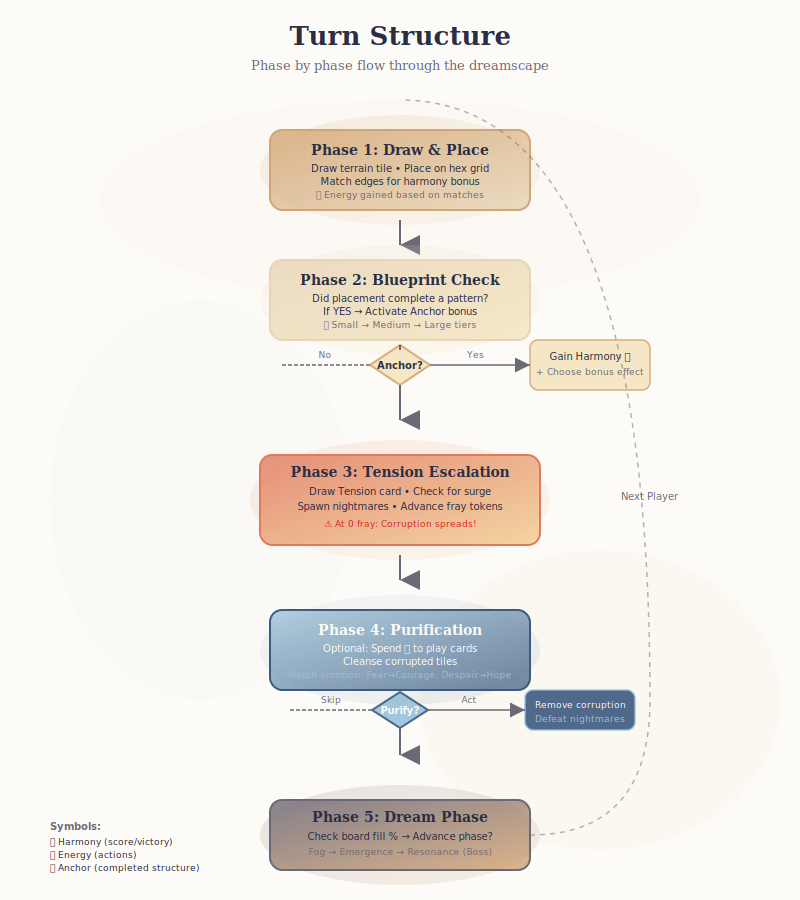
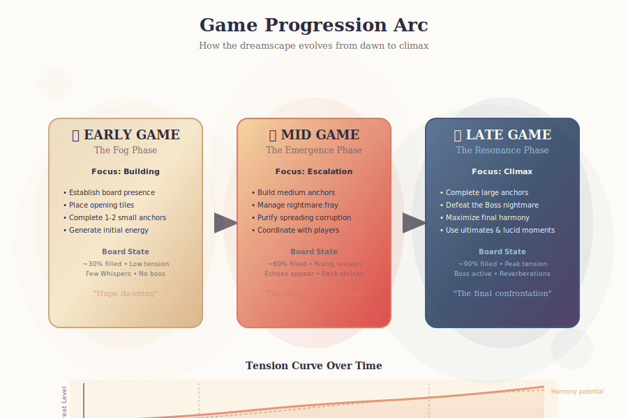

# Core Loop

> *The heartbeat of Yumea: how tile placement creates harmony, how tension escalates, and how players restore balance to the dreamscape.*

---

## Loop Overview


*Phase by phase through the dreamscape: from tile placement to dream phase progression*

```
┌─────────────────────────────────────────────────────────────────┐
│                        YUMEA CORE LOOP                          │
├─────────────────────────────────────────────────────────────────┤
│                                                                 │
│  ┌──────────────┐    ┌──────────────┐    ┌──────────────┐      │
│  │ TILE DRAW    │───▶│ PLACEMENT    │───▶│ HARMONY      │      │
│  │ (Terrain bag)│    │ (Hex grid)   │    │ CHECK        │      │
│  └──────────────┘    └──────────────┘    └──────────────┘      │
│         │                   │                   │               │
│         │                   │                   ▼               │
│         │                   │            ┌──────────────┐      │
│         │                   │            │ ENERGY GAIN  │      │
│         │                   │            │ (💠 = action)│      │
│         │                   │            └──────────────┘      │
│         │                   │                   │               │
│         ▼                   ▼                   ▼               │
│  ┌──────────────────────────────────────────────────────┐     │
│  │              BLUEPRINT COMPLETION?                    │     │
│  │   (Match pattern → Activate anchor → Gain bonus)     │     │
│  └──────────────────────────────────────────────────────┘     │
│         │                    │                                  │
│         ▼                    ▼                                  │
│  ┌──────────────┐    ┌──────────────┐                         │
│  │ NIGHTMARE    │    │ PURIFICATION │                         │
│  │ ESCALATION   │◄───│ (Optional)   │                         │
│  │ (Tension     │    │ (Spend 💠)   │                         │
│  │  deck draw)  │    └──────────────┘                         │
│  └──────────────┘           │                                  │
│         │                   │                                  │
│         ▼                   ▼                                  │
│  ┌──────────────────────────────────────────────────────┐     │
│  │              CORRUPTION SPREAD?                       │     │
│  │   (Nightmare in play → Adjacent tiles corrupt)       │     │
│  └──────────────────────────────────────────────────────┘     │
│         │                                                      │
│         ▼                                                      │
│  ┌──────────────┐    ┌──────────────┐                         │
│  │ DREAM PHASE  │───▶│ NEXT PLAYER  │                         │
│  │ CHECK        │    │              │                         │
│  └──────────────┘    └──────────────┘                         │
│                                                                 │
└─────────────────────────────────────────────────────────────────┘
```


*The circular flow of a turn: creation → tension → response → renewal*

---

## Phase 1: Tile Draw & Placement


*How the game evolves from early building through climactic confrontation*

### Tile Types

| Type | Count | Description |
|------|-------|-------------|
| **Environmental** | ~90% | Core terrain: Forest, Meadow, Hills, Water |
| **Special** | ~8% | Effect tiles with unique properties |
| **Dreamtide** | ~2% | Glitched tiles with 1 wildcard edge |

### Terrain-Emotion Mapping

| Terrain | Pure State | Corrupted State | Primary Emotion |
|---------|------------|-----------------|-----------------|
| 🌲 Forest | Lush, magical | Decayed, dense | Fear ↔ Courage |
| 🌾 Meadow | Cheerful, open | Withered, hollow | Despair ↔ Hope |
| ⛰️ Hills | Rocky, sunlit | Cracked, looming | Isolation ↔ Connection |
| 💧 Water | Calm, reflective | Stagnant, murky | Chaos ↔ Balance |

### Placement Rules

1. **Adjacent Placement**: Must touch at least one existing tile (hex grid)
2. **Edge Matching**: Matching terrain edges grant bonuses; mismatches cost harmony
3. **Corruption Restrictions**: Cannot place on corrupted tiles (must purify first)
4. **Dream Energy Cost**: Some placements cost 💠 (special tiles, zone-unlocked areas)

### Harmony Gain Table

| Match Type | Harmony (🕊️) | Energy (💠) |
|------------|---------------|-------------|
| 0 matches | -1 | 0 |
| 1 match | +1 | 0 |
| 2 matches | +2 | +1 |
| 3 matches | +3 | +2 |

---

## Phase 2: Blueprint Completion

### Anchor System

Anchors are emotionally resonant structures built from harmonious tile patterns.

**Completion Rules**:
- Must place the final tile to complete the pattern
- All contributing tiles must be harmonious (not corrupted)
- Each tile can only be used in one structure
- Token linking: Color + number matched between tile and blueprint

### Anchor Tiers

| Tier | Size | Tile Req | Harmony Reward | Bonus Options |
|------|------|----------|----------------|---------------|
| **Small** | 1 hex + 1–2 adj | 2–3 tiles | 2–3 🕊️ | Minor effect |
| **Medium** | 1 hex + 3–4 adj | 3–4 tiles | 5–8 🕊️ | Moderate effect |
| **Large** | 1 hex + 5–7 adj | 6–7 tiles | 12–14 🕊️ | Major effect choice |

### Tier III Anchor Bonus Options

| Bonus Type | Description | Emotional Resonance |
|------------|-------------|---------------------|
| **Empowerment – Energy** | +3 💠 | Momentum, Drive |
| **Empowerment – Purification** | Draw 2 cards | Clarity, Healing |
| **Empowerment – Goal Surge** | Draw 1 new goal | Growth, Purpose |
| **Fray Delay – Targeted** | Place 3 🧿 on 1 nightmare | Suppression |
| **Fray Delay – Distributed** | Place 1 🧿 on all nightmares | Collective Resilience |
| **Memory Reclaimed** | Draw top small blueprint, auto-complete if pattern exists | Nostalgia, Discovery |
| **Lucid Awakening** | +1 Lucid Moment or unlock Awakening | Insight, Growth |

---

## Phase 3: Tension & Nightmare Escalation

### Tension Deck Mechanics

- **Deck Shrinking**: As cards are drawn, remaining cards become more potent
- **Surge Events**: Special escalation triggers that accelerate nightmare activity
- **Emotional Triggers**: Each card tied to Fear, Despair, Chaos, or Isolation

### Nightmare Tiers

| Tier | Name | Threat Level | Spawn Trigger |
|------|------|--------------|---------------|
| I | Whispers | Low | Early tension cards |
| II | Echoes | Medium | Mid-game escalation |
| III | Reverberations | High | Late-game/surge events |

### Nightmare Behavior

1. **Fray Counter**: Each nightmare has a countdown (🧿 tokens)
2. **Corruption Spread**: At 0 fray, corrupts adjacent tiles
3. **Attribute Matching**: Fear nightmares corrupt forests; Despair corrupts meadows, etc.
4. **Mini-Boss Trigger**: 2 🧿 threshold spawns special behavior

### Corruption Effects

| Corrupted State | Effect |
|-----------------|--------|
| **Visual** | Tile flips to dark/negative version |
| **Mechanical** | No harmony, energy, or anchor effects |
| **Spread** | Can corrupt adjacent tiles via nightmare proximity |
| **Restoration** | Requires purification cards + energy |

---

## Phase 4: Purification

### Purification Deck

- **Size**: 80 cards (current design)
- **Draw**: 1 card/turn standard; extras cost 💠
- **Hand Limit**: 5 cards (can be modified by anchors/personas)

### Card Types

| Type | Effect | Emotion Alignment |
|------|--------|-------------------|
| **Immediate** | Purify 1 tile instantly | Any |
| **Conditional** | Purify if nightmare matches attribute | Counter-emotion |
| **Aura** | Create protection zone for X turns | Connection, Balance |
| **Combo** | Chain purification across adjacent tiles | Courage |

### Attribute Matching

| Nightmare Attribute | Counter Emotion | Purification Bonus |
|---------------------|-----------------|---------------------|
| 🕷️ Fear | ✨ Courage | +1 token if persona aligned |
| 🌫️ Despair | 🌈 Hope | +1 token if persona aligned |
| 🔥 Chaos | 🌀 Balance | +1 token if persona aligned |
| 🪞 Isolation | 🤝 Connection | +1 token if persona aligned |

---

## Phase 5: Dream Phase Progression

### Zone Structure

| Phase | Zone | Emotional State | Unlock Condition |
|-------|------|-----------------|------------------|
| 1 | **Fog** | Confusion, uncertainty | Start of game |
| 2 | **Emergence** | Hope dawning | Board 30% filled |
| 3 | **Resonance** | Clarity, breakthrough | Board 60% filled or boss spawn |

### Phase Effects

- **Fog**: Nightmares spawn more frequently; tile draw limited
- **Emergence**: Standard gameplay; moderate tension
- **Resonance**: Boss nightmare active; final confrontation begins

### Game End Conditions

| Condition | Trigger | Resolution |
|-----------|---------|------------|
| **Dream Resolution** | Boss defeated | Victory; harmony tallied |
| **Collapse** | Tension deck depleted with boss undefeated | Defeat; partial scoring |
| **Harmonic Ascension** | Board filled + 6 turns after boss | Scoring variant |

---

## Emotional Feedback Loops

### Positive Loops (Restoration)

```
Tile Placement → Harmony Gain → Blueprint Completion → 
Anchor Bonus → Energy Surge → Purification → 
Corruption Cleansed → More Placement Options
```

### Negative Loops (Collapse)

```
Nightmare Spawn → Fray Countdown → Corruption Spread → 
Tile Loss → Reduced Harmony → Energy Strain → 
Fewer Purification Options → Accelerated Corruption
```

### Balancing Mechanisms

| Mechanism | Purpose |
|-----------|---------|
| **Soft Catch-Up** | Players behind on harmony gain +1 on next placement |
| **Shared Tension** | Nightmares threaten all; cooperation rewarded |
| **Persona Diversity** | Different roles can compensate for others' weaknesses |

---

## Critical Paths & Bottlenecks

### Critical Path to Victory

1. **Early Game**: Establish harmony base; complete 1–2 small anchors
2. **Mid Game**: Build medium anchors; manage nightmare fray counters
3. **Late Game**: Complete large anchors; defeat boss via purification

### Common Bottlenecks

| Bottleneck | Cause | Mitigation |
|------------|-------|------------|
| **Energy Choke** (1–2p) | Low tile harmony luck | Baseline 1 💠/turn variant |
| **Token Sprawl** (4–6p) | Too many markers | Dual-layer board overlays |
| **Quiet Early Turns** | Insufficient tension | +1 🧿 spawn rule for 4–6p |
| **Blueprint Overwhelm** | Too many options | Guided draft variant for first game |

---

## Inter-System Dependencies

| System | Depends On | Enables |
|--------|------------|---------|
| **Tile Placement** | Tile bag, board state | Harmony, blueprints |
| **Harmony** | Tile placement | Energy, scoring, phase progression |
| **Blueprints** | Tile placement, harmony | Anchor bonuses, victory points |
| **Nightmares** | Tension deck | Corruption, urgency |
| **Purification** | Energy, cards | Corruption removal, boss defeat |
| **Dream Phases** | Board fill % | Escalation, boss spawn |

---

## Design Health Assessment

| Aspect | Score | Notes |
|--------|-------|-------|
| **Clarity** | 8/10 | Core loop intuitive; complexity in edge cases |
| **Emotional Resonance** | 10/10 | Every phase reflects emotional journey |
| **Strategic Depth** | 8/10 | Multiple viable paths; emergent combos |
| **Accessibility** | 7/10 | Family mode helps; 4–6p needs UX polish |
| **Replayability** | 8/10 | Modular systems support high variability |

---

*Next: [[systems/personas|Personas]] — The 12 Dreamscapers and their emotional archetypes*
