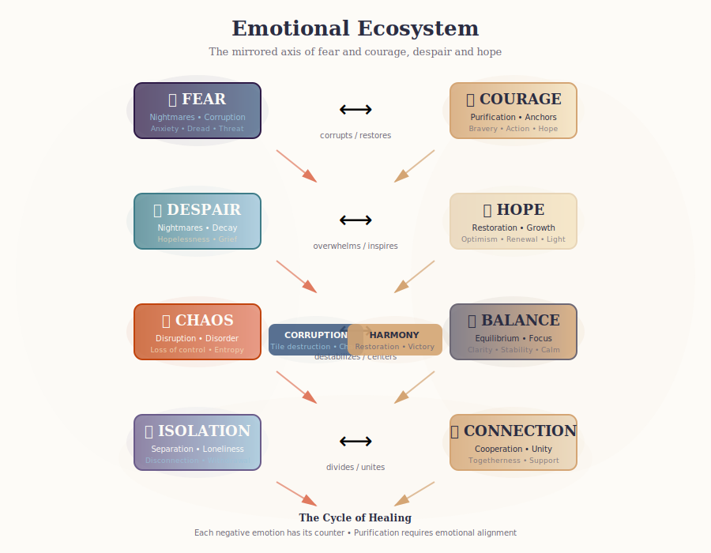

# Nightmares

> *Manifestations of the dreamer's inner fears — corruption mechanics, tier system, and the tension they bring to the dreamscape.*

---

## Overview

Nightmares in Yumea are **not monsters** in the traditional sense. They are:
- **Visual metaphors** for emotional disturbance
- **Abstract representations** of fear, despair, isolation, and chaos
- **Pressure systems** that drive cooperative urgency
- **Opportunities for healing** when purified

Nightmares embody the mirrored emotional axis:


*Each nightmare attribute feeds into corruption — each has a counter emotion for purification*

| Nightmare Attribute | Represents | Counter Emotion |
|---------------------|------------|-----------------|
| 🕷️ Fear | Anxiety, dread, threat | ✨ Courage |
| 🌫️ Despair | Hopelessness, grief | 🌈 Hope |
| 🔥 Chaos | Disorder, loss of control | 🌀 Balance |
| 🪞 Isolation | Loneliness, disconnection | 🤝 Connection |


*Escalation from subtle whispers to world-shaking reverberations*

---

## Nightmare Philosophy

### Design Principles

1. **Symbolic, Not Literal**: Nightmares are suggested forms, not detailed creatures
2. **Emotion First**: Every nightmare is a pure expression of one (or two) emotions
3. **Eerie, Not Terrifying**: Suitable for family play; unsettling but not traumatic
4. **Visible Threat**: Board state must clearly show nightmare presence and danger
5. **Healable**: All nightmares can be purified; no permanent damage

### Visual Style

- **Painterly, storybook aesthetic** — oil, gouache, watercolor textures
- **Silhouetted or abstract forms** — details suggested, not shown
- **Glowing features** — eyes, cores, or lines emphasize presence
- **Dreamlike logic** — floating limbs, bodies fading into fog
- **Avoid**: Realistic violence, grotesque horror, jump scares

---

## Tier System

### Tier I: Whispers

| Attribute | Value |
|-----------|-------|
| **Threat Level** | Low |
| **Fray Tokens** | 3–4 🧿 |
| **Corruption Range** | 1 tile |
| **Spawn Trigger** | Early tension cards |
| **Victory Points** | 2 🕊️ when purified |

**Behavior**:
- Slow, subtle corruption spread
- Single-attribute focus
- Often spawn in Fog phase

**Example Whispers**:

| Name | Attribute | Effect |
|------|-----------|--------|
| **The Doubt** | 🌫️ Despair | Adjacent tiles cost +1 💠 to purify |
| **The Flutter** | 🕷️ Fear | Players adjacent draw 1 fewer tile |
| **The Scatter** | 🔥 Chaos | Random adjacent tile corrupts on spawn |

---

### Tier II: Echoes

| Attribute | Value |
|-----------|-------|
| **Threat Level** | Medium |
| **Fray Tokens** | 2–3 🧿 |
| **Corruption Range** | 2 tiles |
| **Spawn Trigger** | Mid-game escalation |
| **Victory Points** | 4 🕊️ when purified |

**Behavior**:
- Faster countdown
- Dual-attribute possible
- Spawn in Emergence phase

**Example Echoes**:

| Name | Attributes | Effect |
|------|------------|--------|
| **The Hollow** | 🌫️🪞 Despair+Isolation | Corrupted tiles adjacent don't count for harmony |
| **The Tremor** | 🕷️🔥 Fear+Chaos | On spawn, corrupts 2 random tiles in range |
| **The Veil** | 🪞🌫️ Isolation+Despair | Players cannot give cards while adjacent |

---

### Tier III: Reverberations

| Attribute | Value |
|-----------|-------|
| **Threat Level** | High |
| **Fray Tokens** | 2 🧿 (mini-boss trigger) |
| **Corruption Range** | 3 tiles |
| **Spawn Trigger** | Late game, surge events |
| **Victory Points** | 8 🕊️ when purified |

**Behavior**:
- Rapid escalation
- "Collapse Loop" — can delete structure tiles
- Boss nightmare potential

**Example Reverberations**:

| Name | Attributes | Effect |
|------|------------|--------|
| **The Collapse** | 🔥🕷️ Chaos+Fear | On 0 fray: Remove all structures in range 2 |
| **The Void** | 🪞🌫️ Isolation+Despair | Adjacent anchors deactivate |
| **The Unraveling** | 🔥🌫️ Chaos+Despair | Tension deck shuffles; draws +1 card |

---

### Boss Nightmares

| Attribute | Value |
|-----------|-------|
| **Spawn Condition** | Tension deck specific card OR phase 3 |
| **Fray Tokens** | 4–5 🧿 |
| **Corruption Range** | Board-wide or 4 tiles |
| **Victory Condition** | Must be defeated to win |

**Boss Design**:
- Unique name and art for each dreamer
- Multiple attributes (usually 3)
- Special "Desperation" phase at 1 🧿
- Victory when purified

**Example Boss: "The Absence" (Generic)**
- Attributes: 🕷️🌫️🪞 Fear+Despair+Isolation
- Effect: All players discard to 2 cards at start of their turn
- Desperation: Corruption spreads to all adjacent tiles each turn

---

## Corruption Mechanics

### How Corruption Spreads

```
Nightmare at 0 fray → Check adjacent tiles → 
Corrupt those matching nightmare's primary attribute → 
Corrupted tiles become "dead" (no effects, no harmony)
```

### Corrupted Tile Effects

| Aspect | Effect |
|--------|--------|
| **Visual** | Tile flips to dark/desaturated version |
| **Harmony** | No harmony gain from placement |
| **Energy** | No energy generation |
| **Anchors** | Cannot be part of anchor completion |
| **Spread** | Can be source of further corruption |

### Purification

To cleanse corrupted tiles:

1. **Spend Energy**: 1–2 💠 per tile (varies by tier)
2. **Play Purification Card**: Matching counter-emotion
3. **Anchor Effect**: Some anchors purify adjacent
4. **Persona Ability**: Some personas can purge

### Protection

| Mechanism | Effect |
|-----------|--------|
| 🧿 Protection aura | Corruption spreads 1 less |
| 🚫🧿 Spawn block | Nightmares cannot spawn |
| Sentinel persona | +1 fray on adjacent nightmares |
| Guardian persona | May take corruption for others |

---

## Nightmare Scaling

### Player Count Scaling

| Players | Whispers | Echoes | Reverberations | Boss |
|---------|----------|--------|----------------|------|
| 1 | 2 | 1 | 0 | 1 |
| 2 | 3 | 2 | 1 | 1 |
| 3–4 | 4 | 3 | 2 | 1 |
| 5–6 | 5 | 4 | 3 | 1 |

### Hard Mode Modifiers

| Modifier | Effect |
|----------|--------|
| **+1 Spawn** | All spawn checks +1 nightmare |
| **Fast Fray** | Fray removes 2 tokens/turn |
| **Corrupting Touch** | Nightmares corrupt on spawn |
| **No Escape** | Boss spawns at 50% board fill |

---

## Emotion-Tuned Modifiers

Nightmares can gain behavioral modifiers without stat changes:

| Modifier | Attribute | Effect |
|----------|-----------|--------|
| **Hunting** | 🕷️ Fear | Moves 1 tile toward nearest player each turn |
| **Seeping** | 🌫️ Despair | Corruption spreads through water tiles |
| **Fragmenting** | 🔥 Chaos | Splits into 2 weaker nightmares on defeat |
| **Withdrawing** | 🪞 Isolation | Cannot be targeted until adjacent |

---

## Nightmare Deck

### Deck Composition

| Tier | Count | Distribution |
|------|-------|--------------|
| Whispers | 12 | 3 per attribute |
| Echoes | 10 | Mixed dual-attribute |
| Reverberations | 6 | High threat |
| Bosses | 4 | Dreamer-specific |
| **TOTAL** | **32** | (Current: need 30+ per GDD) |

*Gap: Need 6–8 additional nightmare designs for replayability*

### Draw Mechanics

- **Spawn Check**: Draw nightmare card on tension deck surge
- **Placement**: Spawn at corruption source or random valid location
- **Escalation**: Higher tier nightmares replace lower tier when deck cycles

---

## Nightmare-Persona Interactions

### Synergies

| Persona | Nightmare Interaction |
|---------|----------------------|
| **Sentinel** | +1 fray on adjacent nightmares |
| **Guardian** | May take corruption for adjacent player |
| **Trickster** | Can move nightmare to new location |
| **Pathfinder** | Ignores corruption for placement |
| **Seer** | Can look at top nightmare card |

### Counters

| Nightmare Attribute | Counter Persona | Effectiveness |
|---------------------|-----------------|---------------|
| 🕷️ Fear | Any Courage-aligned | +1 purification token |
| 🌫️ Despair | Any Hope-aligned | +1 purification token |
| 🔥 Chaos | Any Balance-aligned | +1 purification token |
| 🪞 Isolation | Any Connection-aligned | +1 purification token |

---

## Art Direction

### Nightmare Card Layout

```
┌─────────────────────┐
│    [Title Area]     │
│      THE VOID       │
├─────────────────────┤
│                     │
│   [Art Frame]       │
│   Abstract form     │
│   Emotional color   │
│                     │
├─────────────────────┤
│ "Flavor text"       │
│ — italic, evocative │
├─────────────────────┤
│ [Scaling Table]     │
│ Players | Attributes│
│ 1–2: 4🕷️ 2🌫️       │
│ 3–4: 5🕷️ 3🌫️       │
│ 5–6: 6🕷️ 3🌫️       │
└─────────────────────┘
```

### Color Integration

| Attribute | Dominant Color | Accent Use |
|-----------|----------------|------------|
| 🕷️ Fear | Deep Indigo (#2E1A47) | Shadows, fog |
| 🌫️ Doubt | Dusty Teal (#3E7C88) | Mist, glow |
| 🔥 Chaos | Warm Amber-Red (#C1440E) | Cracks, edges |
| 🪞 Isolation | Muted Violet (#6A5B8A) | Void, background |

---

## Gaps & Missing Content

### High Priority

1. **Dreamer-Specific Bosses**: Only generic boss designed; need 4 unique
2. **Modifier Deck**: Emotion-tuned modifiers need cards/reference
3. **Nightmare-Nightmare Interactions**: What happens when they overlap?

### Medium Priority

4. **Campaign Nightmares**: Persistent nightmares across sessions
5. **Nightmare Evolution**: Nightmares that grow if ignored
6. **Purification Reactions**: Different effects based on counter-emotion used

### Low Priority (Expansions)

7. **Nightmare playable mode**: Players AS nightmares (sequel concept)
8. **Hybrid nightmares**: Three-attribute threats

---

## Open Questions

1. **Collapse Loop Feel-Bad**: Should there be a "brace window" to protect structures?
2. **Nightmare Memory**: Should defeated nightmares return in longer games?
3. **Emotional Contagion**: Can nightmares shift attributes based on board state?
4. **Nightmare Allies**: Can any nightmares be "turned" to help players?

---

*Next: [[systems/cards|Cards]] — Purification deck, goal cards, and what's missing*
